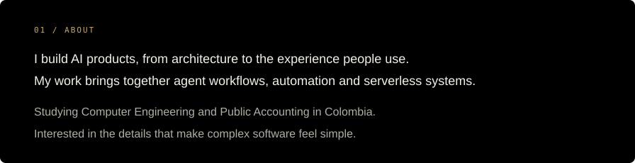
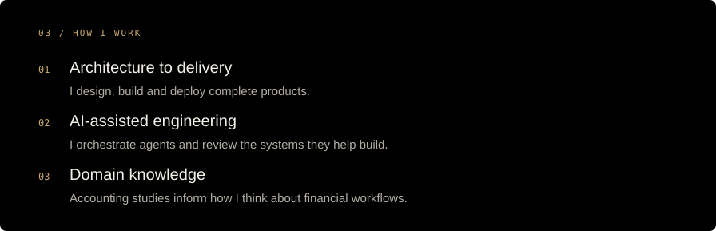
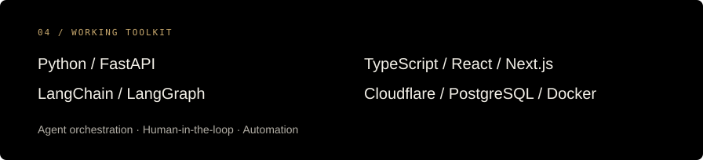
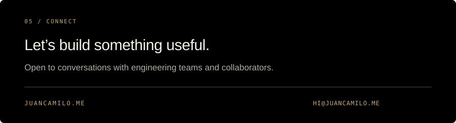

<!-- Profile artwork is editable SVG. Text equivalents are provided as image alt text. -->

  <a href="https://juancamilo.me"><picture><source media="(max-width: 600px)" srcset="assets/hero-mobile.svg" /></picture></a>

  <a href="https://juancamilo.me">Portfolio</a> &nbsp; · &nbsp;
  <a href="mailto:hi@juancamilo.me">Contact</a> &nbsp; · &nbsp;
  <a href="https://github.com/invrnt?tab=repositories">Repositories</a>

<picture><source media="(max-width: 600px)" srcset="assets/about-mobile.svg" /></picture>

<picture><source media="(max-width: 600px)" srcset="assets/selected-mobile.svg" /></picture>

<a href="https://classmate.studio"><picture><source media="(max-width: 600px)" srcset="assets/classmate-mobile.svg" /></picture></a>

<a href="https://orientador.co"><picture><source media="(max-width: 600px)" srcset="assets/orientador-mobile.svg" /></picture></a>

<picture><source media="(max-width: 600px)" srcset="assets/count-mobile.svg" /></picture>

<picture><source media="(max-width: 600px)" srcset="assets/approach-mobile.svg" /></picture>

<picture><source media="(max-width: 600px)" srcset="assets/toolkit-mobile.svg" /></picture>

  
  &nbsp;
  <a href="https://github.com/invrnt?tab=repositories">Occasional open-source work ↗</a>

<a href="https://juancamilo.me"><picture><source media="(max-width: 600px)" srcset="assets/connect-mobile.svg" /></picture></a>

<a href="mailto:hi@juancamilo.me">hi@juancamilo.me</a>

