<picture>
  <source media="(prefers-color-scheme: light) and (prefers-reduced-motion: reduce)" srcset="assets/desk-light-still.svg" />
  <source media="(prefers-reduced-motion: reduce)" srcset="assets/desk-dark-still.svg" />
  <source media="(prefers-color-scheme: light)" srcset="assets/desk-light.svg" />
  
</picture>

### Juan Camilo

I build AI products and the systems behind them. Based in Colombia, studying Computer Engineering and Public Accounting.

Agent workflows, automation, and a particular interest in making complex software simple to use.

 

#### On my desk

**Count** · Personal finance with AI. Keeping the experience simple while building the capabilities underneath. Private project.

**[Classmate Studio](https://classmate.studio)** · A conversational assistant for university life, with academic workflows, research and document generation.

**[Orientador.co](https://orientador.co)** · AI-assisted documentation for school counselors in Colombia, with human review.

 

#### Outside the main projects

Occasionally, I turn a tool I want into something public. [GoalWatch](https://github.com/invrnt/goalwatch) is one of those: AI-assisted focus for the Linux desktop.

A little more about how I build

I work across architecture, implementation and deployment. I use AI agents throughout development and review the systems they help produce.

My usual tools are Python, FastAPI, TypeScript, React, Next.js, LangChain, LangGraph, Cloudflare and PostgreSQL. My accounting studies also inform my interest in financial workflows.

 

Open to conversations with engineering teams and fellow builders.

[Website](https://juancamilo.me) &nbsp; / &nbsp; [Email](mailto:hi@juancamilo.me) &nbsp; / &nbsp; [Repositories](https://github.com/invrnt?tab=repositories)
