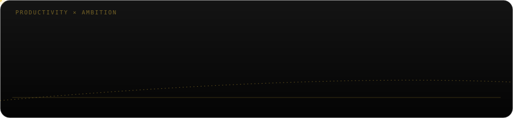

<picture>
  <source media="(prefers-reduced-motion: reduce)" srcset="assets/header-still.svg" />
  
</picture>

# Juan Camilo

**AI Engineer & Product Builder · Colombia**

*Complexity compounds inside. Simplicity ships outside.*

[Website](https://juancamilo.me) · [Email](mailto:hi@juancamilo.me) · [LinkedIn](https://linkedin.com/in/jc-ga) · [Repositories](https://github.com/invrnt?tab=repositories)

### 00 — Philosophy

Every system I build follows one rule: push the complexity inward, strip it from the surface. The engine underneath can be enormous — double-entry ledgers, multi-agent reasoning, live market data, legal edge cases. What reaches the person using it is one sentence, one voice note, one tap. Never more than that.

### 01 — Count · finance you talk to

A personal finance system with no forms.

- Say **"Lent Kevin $5,000 from Bancolombia at 1.5% a month"** — it leaves the right Pod, opens a debt ledger, and compounds the exact interest on its own.
- Say **"Bought 10 shares of KO"** — live price tracking, dividends booked the day they land.
- Say **"Fixed up the Ontario rental, $12k"** — Count re-appraises it against comparable listings and updates the value.

When something's ambiguous, it asks — once, in plain language, on a screen built to be answered with a tap.

Underneath: double-entry ledgers, Pods, live market data, real-estate comps, cron jobs quietly compounding interest every night. None of it visible. That's the design, not an accident.

Private project, in development.

### 02 — Also shipping

- **[Classmate Studio](https://classmate.studio)** — an agent that runs a student's academic life. Give it a rubric, get back a finished paper: sourced, reasoned, typeset, written in the student's own voice.
- **[Orientador.co](https://orientador.co)** — Colombian school counselors stop doing paperwork. Compliance forms and case files get generated, not filled in.

### 03 — Why this matters

AI's biggest unlock isn't conversation — it's collapsing the cost of complex, valuable work until every industry can afford to be ambitious again. That compounding, not the models themselves, is what gets us close to utopia once ASI arrives.

<b>04 — Stack</b> (the complexity behind sections 01–02)

 

`AI & Agents` — LangChain · LangGraph · n8n · multi-agent orchestration · RAG / embeddings

`Backend` — Python · FastAPI · Django · PostgreSQL

`Frontend` — Next.js · React · TypeScript · Tailwind CSS

`Infra` — Cloudflare Workers / D1 / R2 · AWS Lambda · Google Cloud Run · Docker

`Also in the toolkit` — Public accounting · Colombian regulatory frameworks · Typst / LaTeX

Open to conversations with engineering teams and fellow builders.

[Website](https://juancamilo.me) · [Email](mailto:hi@juancamilo.me) · [LinkedIn](https://linkedin.com/in/jc-ga) · [Repositories](https://github.com/invrnt?tab=repositories)

Built to look simple. Engineered not to be.

